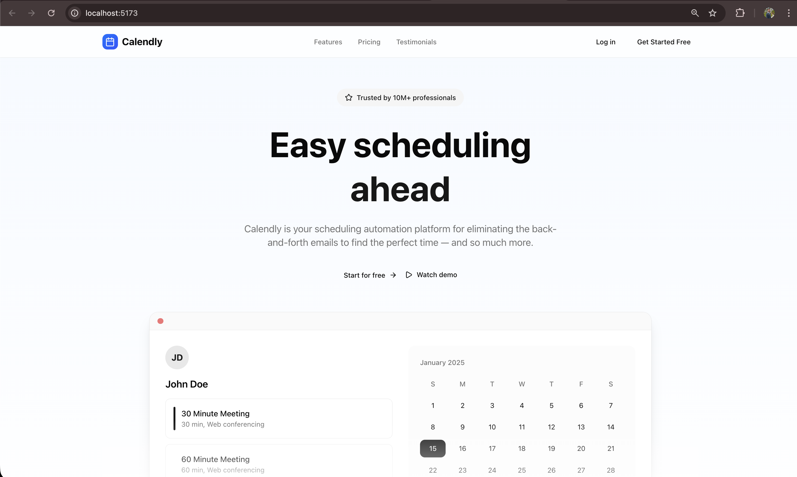
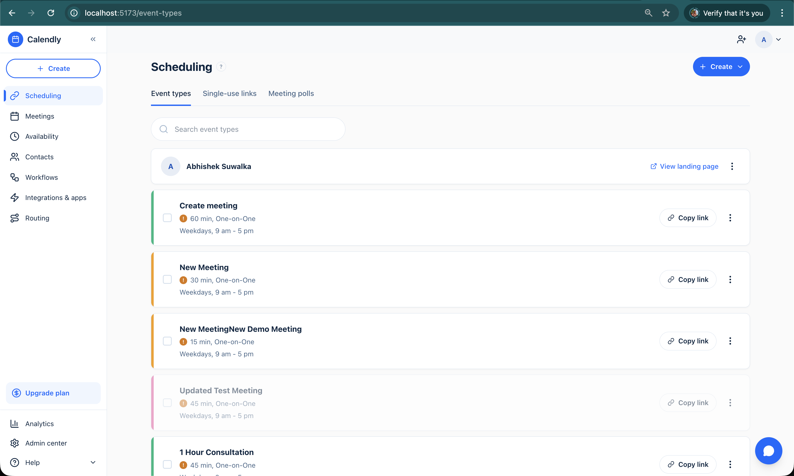
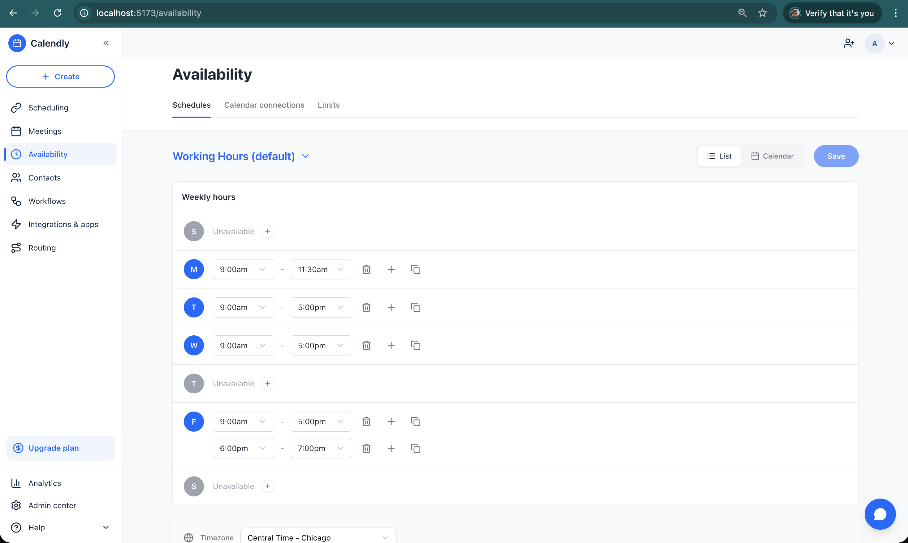
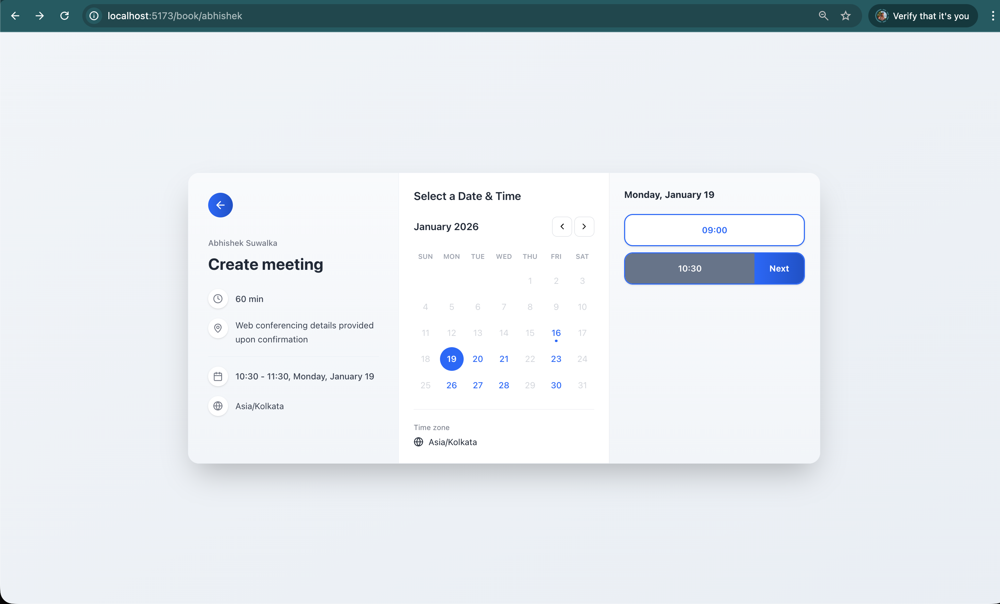
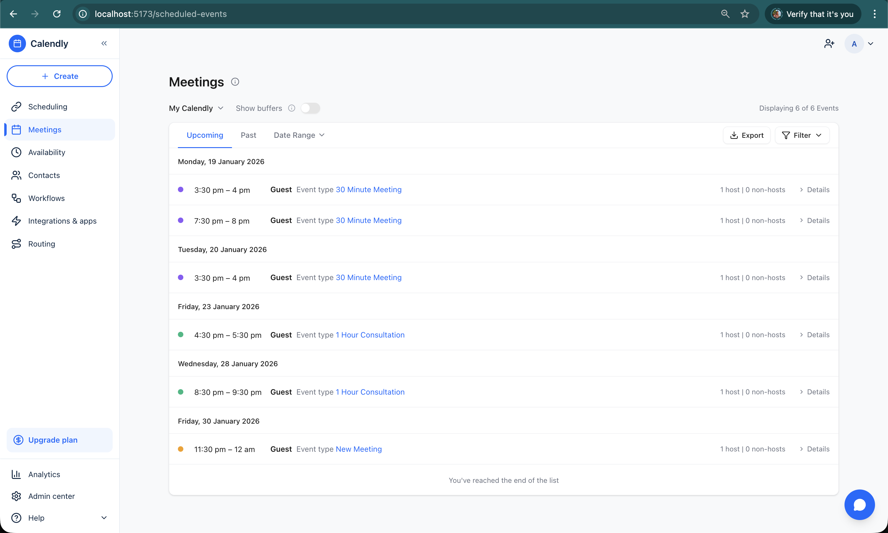
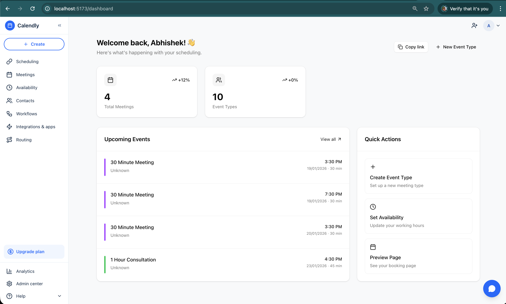

# Calendly Clone

A pixel-perfect, production-ready scheduling application that replicates Calendly's core functionality. Features a modern React frontend with a FastAPI backend, deployed on Vercel.

<p align="center">
  <a href="https://calendly-clone-dusky.vercel.app/">View Live Demo</a>
</p>



---

## Tech Stack

| Frontend | Backend | Database |
|----------|---------|----------|
| React 19 | FastAPI | PostgreSQL |
| Vite 7 | Prisma ORM | - |
| Tailwind CSS 4 | Pydantic | - |
| Radix UI | Uvicorn | - |
| React Query | - | - |

---

## Features

### 📅 Event Type Management
Create and manage customizable meeting types with full CRUD operations.

- Multiple duration options (15, 30, 45, 60 min)
- Custom colors for visual organization  
- Buffer times before/after meetings
- Minimum notice period and max days ahead limits
- Toggle active/inactive status
- Duplicate event types



---

### ⏰ Availability Scheduling
Define when you're available for meetings.

- Weekly recurring hours (per-day configuration)
- Date-specific overrides
- Multiple timezone support
- Copy hours to other days
- Calendar and list view options



---

### 🔗 Public Booking Page
Shareable booking links for invitees.

- Clean, multi-step booking flow
- Calendar view with available dates highlighted
- Time slots based on host availability
- Timezone selection for invitees
- Guest information collection
- Booking confirmation with details



---

### 📋 Scheduled Events Dashboard
Manage all your meetings in one place.

- Upcoming and past meetings tabs
- Date range filtering
- Filter by event type
- Cancel meetings with reason tracking
- Add private meeting notes
- Export to CSV
- Reschedule functionality



---

### 🏠 Dashboard
Quick overview of your scheduling activity.

- Meeting statistics
- Upcoming events preview
- Quick action shortcuts
- Copy booking link



---

## API Endpoints

| Resource | Operations |
|----------|------------|
| **Event Types** | List, Create, Read, Update, Delete, Toggle, Duplicate |
| **Availability** | Get/Update schedule, List schedules, Date overrides, Timezone |
| **Bookings** | Available dates/slots, Create booking, Get confirmation |
| **Meetings** | List, Details, Cancel, Notes (CRUD) |
| **Users** | Current user profile |

Interactive API docs available at `/docs` (Swagger) and `/redoc`.

---

## Getting Started

### Prerequisites
- Node.js 18+
- Python 3.10+
- PostgreSQL 14+

### Backend

```bash
cd backend
python -m venv venv && source venv/bin/activate
pip install -r requirements.txt
cp .env.example .env  # Configure DATABASE_URL
prisma generate && prisma db push
python -m src.main
```

### Frontend

```bash
cd frontend
npm install
echo "VITE_API_URL=http://localhost:8000" > .env
npm run dev
```

---

## Deployment

Both applications are deployed on **Vercel**.

| App | URL |
|-----|-----|
| Frontend | [calendly-clone-dusky.vercel.app](https://calendly-clone-dusky.vercel.app/) |
| Backend | calendly-clone-b.vercel.app |

---

## Database Schema

```
User ─┬─ EventType ── Booking ── MeetingNotes
      └─ AvailabilitySchedule ─┬─ WeeklyHours
                               └─ DateOverride
```

---

## Author

**Abhishek Suwalka**

[](mailto:suwalkabhishek@gmail.com)
[](https://linkedin.com/in/abhisheksuwalka)
